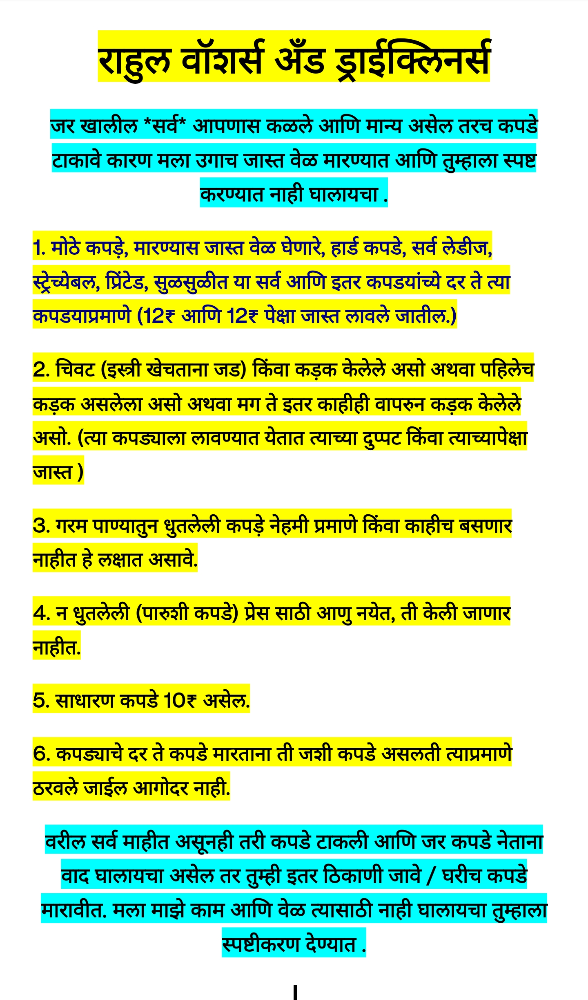

# Rahul-Washers-And-DryCleaners

## **सर्वांसाठी उधारी बंद करीत आहे तुम्हाला रोख दयावी लागेल/ऑनलाइन इथेच दुकानासमोर करावी लागेल.**
## **जर उधारी देणे तुम्हाला जमत नाही , तर पुन्हा इकडे फिरकु नऐ .**
## **ज्यांना खरच दयायची असते ते लगेच देऊन मोकळे होतात उगाच नाही काहीतरी कारणे सांगुन ( बघतो , करतो , देतो , काय करायचं ते कर , उगाच मला नडतो असे म्हणुन ) टाळत बसत .**
## **बऱ्याच वेळा QR code पाठवुन सुद्धा माझ्या लक्ष्यात नाही राहीले, मि विसरलो (हे अगदी कधीतरी ऐकण्यास बरे वाटते वारंवार नाही) ,खर तर बऱ्याच वेळा हातात मोबाईल हा असतोच पण तरी वेळेत दयायचेच नसेल तर काय करणार .**
## **ऑनलाइन करताना कधीतरी प्रॉब्लेम हा येतोच असतो म्हणुन योग्य ती रक्कम जवळ बागळावी . दोनीही नसेल तर कपडे नंतर घेऊन जावी उधार मिळणार नाही .**
## -------------------------

## **दुकान बंद/चालु ची नोंद खाली आहे**

## **१. कपडे आलेल्या क्रमानेच तयार होतील ( एक असेल तरीही ).**

## **२. अर्जंट कपडे तयार होणार नाहीत .**

## **३. कपड़े तयार होण्यास सांगितलेल्या / आपण गृहीत धरलेल्या वेळेपेक्षा जास्त उशीर होऊ शकतो .** 

## **४. पारुशी कपडे ( घालून न धुता परत प्रेस ला टाकणे ) प्रेस केली जाणार नाहीत , त्यापेक्षा प्रेस न करता पण व्यवस्तीत धुवून घालावीत.**

## **५. दुकानाची वेळ :  सकाळी ९:०० ते १:०० आणि दुपारनंतर ४:३० ते ८:३० असेल .**
## **दर गुरुवारी दुकान बंद राहील .**

## **६. ज्या दिवशी दुकान बंद त्या दिवशी No कॉल , No msg .**

## **७. उधारी बंद आहे**
## **कारण**
## **आपले हक्काचे पैसे भिकारी म्हणून मागावे लागतात. उधार घेणारे मात्र शेठ बनून तारखे वर तारीख देत असतो.**
## **इतर ठिकाणी मात्र कसे गुमान पैसे घेऊन जातात ,तिथे का नाही हात हालवत जात कारण माहीत आहे तिथे पैसे मोजल्याशिवाय काही मिळणार नाही किंवा कोणी उभे करणार नाही ते.**
## **तुम्हाला जर उधार देऊन/उधारी मागुन सुद्धा जर उधारी वेळेत देण्यास वेळ नाही मिळत / टाळाटाळ करीत असाल तर मग कश्याला हवीय ती उधारी .**
## **आयुष्यभराचे संबंध खराब करते ती म्हणजे उधारी !!.**
## **जर खरच आपण उधारी देण्यास असमर्थ (कौटुंबिक अन्नासाठी सुद्धा पैसे पुरत नसल्यास) असल्यास तसे कळवावे .**

## **८. टाकलेली कपडे १५ दिवसाच्या आत घेऊन जावी नंतर ती आपणास नाही लागत असे गृहीत धरून बॅलन्स कपड्यात काढुन टाकण्यात येतील**

## **९. जर माझ्याकडून कपड्याच्ये उद्योग (जाळणे,फाटने इतर)  झाल्यास तसे आपणास स्पष्टपणे सांगितले जाईल परंतु आपण घरी केलेल्या / बाहेरून इतर कडून केलेले उद्योग माझ्यावर टाकणार असाल तर स्वीकारले जाणार नाही. मला हे कळण्यास जास्त वेळ नाही लागणार कारण तुमचे कपडे येण्याची frequency , तुमचे ठरावीक type चे येणारे कपडे आणि इतर गोष्टी आहेत, कि त्यामुळे हे मला नक्कीच कळेल.**

## **बुधवारी ०१-०५-२०२४ रोजी दुकान बंद राहील.**

## **गुरुवारी ०२-०५-२०२४ रोजी दुकान बंद राहील.**

## **unpaid list**
## **उधारीवाले**

सागर भदिरगे-साई कार केयर 12₹

मधुरा देशमुख-श्रेयश विहार 30 Rs

निलेश नंदकिशोर जोशी 120 Rs

अर्चना रवी चाकणकर 49₹

हृषिकेश सुधींद्र कुलकर्णी 12₹

## **सर्वांसाठी उधारी बंद करीत आहे तुम्हाला रोख पाठवुन दयावी/ऑनलाइन इथेच दुकानासमोर करावे लागेल.**
## **हि नावे मि लगेच नाही टाकत भरपूर दिवस झाल्यानंतर टाकत असतो .**
## **तुमची संपूर्ण उधारी आल्यानंतर वरील नाव काढलं जाईल , तोपर्यंत नाव नाही काढले जाणार .**
## **जर उधारी देणे तुम्हाला जमत नाही , तर पुन्हा इकडे फिरकु नऐ .**
## **ज्यांना खरच दयायची असते ते लगेच देऊन मोकळे होतात उगाच नाही काहीतरी कारणे सांगुन ( बघतो , करतो , देतो , उगाच मला नडतो म्हणुन ) टाळत बसत .**
## **बऱ्याच वेळा QR code पाठवुन सुद्धा माझ्या लक्ष्यात नाही विसरलो ,खर तर बऱ्याच वेळा हातात मोबाईल हा असतोच पण तरी वेळेत दयायचे नसेल तर काय करणार .**
## -------------------------

# Notes

राहुल वॉशर्स अँड ड्राईक्लीनर्स

1. मोठे कपड़े (उदा. 44cm XXL, 38cm आणि + लेबल बघून नाही ठरवत प्रेस करताना जसा लागेल त्यावर ठरवतो ), सर्व लेडीज, स्ट्रेच्येबल, प्रिंटेड, जाळीच्ये, सुळसुळीत कपड़े,बनवण्यास हार्ड कपडे , मारण्यास जास्त वेळ घेणारे इतर अजुन ह्या सर्व कपडयांच्ये दर नेहमीच्या दरात नाही धरले जाणार ते त्या कपड्याप्रमाणे (12 आणि 12+ पर कपड़ा) लावले / आकारले जातील.

2. कड़क केलेले असो अथवा पहिलेच कड़क असलेला असो अथवा मग ते इतर काहीही वापरुन कड़क केलेले असो. (त्या कापड्यास आकारण्यात येतात त्याच्या दुप्पट पर कपड़ा)

3. गरम पाण्यातुन धुतलेली कपड़े नेहमी प्रमाणे / काहीच बसणार नाहीत हे लक्षात असावे .

4. पारुशी कपडे (घालून न धुता परत तशीच प्रेस ला देने) केली जाणार नाहीत, त्यापेक्षा न प्रेस करता पण धुवून व्यसतीत घालावीत.

5. हे सर्व मि कपडे तयार करताना जसे लागतील त्या प्रमाणे ठरवतो, आगोदर नाही (म्हणजे तो कपडा पूर्ण बंडलमध्ये खाली-वर-मध्ये जसा मारताना लागेल तसा ठेवला जातो)

6. याच्या पेक्षा जास्त स्पष्टपणे नाही सांगु शकणार.

7. का? तुमच्ये कपडे (ज्या कपड्यावरून भाष्य करता आहात ते) तेच तुम्हास देतो मारण्यास (ठराविक वेळ देऊन तुम्हाला 10₹ नी हवय ना मग 10₹ साठी जेवढा वेळ लागतो तेवढाच) मग लक्ष्यात येईल मला काय म्हणायचे आहे ते.

8. आशा आहे पुढील वेळेस तुमचा मौल्यवान वेळ नाही जाणार चर्चा करण्यात. का ? कश्याला? कसे? हे विचारण्यात.

0. जर तुम्हाला बॉंबे हात मारून हवाय तर , तुम्ही इतर ठिकाणी जाऊ शकता . तुम्हाला नाही पटत याचा अर्थ तुम्हाला बॉंबे हात मारलेली कपडेच/सगळे प्रकारची कपडे एकाच दरात हवीत . जर असे करायचे झाल्यास बॉंबे हात मारने भाग आहे . मला त्याप्रमाणे नाही मारायचे म्हणुन वरील सर्व . 

10. जसे इतर कपडे घरी मारता तशी ही पण मारावी म्हणजे तुमचा वाद घालण्यात वेळ नाही जाणार आणि पर्यायाने माझाही वेळ नाही जाणार , कारण मला माझे मारणे नाही बदलायचे . याचा अर्थ म्हणजे तुम्हाला सर्वप्रकारच्या कपड्यास एकाच दराकरीता इतर ठिकाणी जावे लागेल . आणि इतर ठिकाणीही असाच वाद घालायचा असल्यास आपण घरीच प्रेस करावे इतरांचा वेळ वाया घालवू नये .

11. कपडे घरीच व्यसतीत/कमीतकमी वेळेत मारता येतील , फक्त अशीच कपडे खरेदी करावी म्हणजे तुम्हाला बाहेर कपडे नाही द्यावी लागणार आणि पर्यायाने वादाचा प्रश्नच येणार नाही .

## **बॉंबे हात मारने = ठराविक वेळेत जसा बसेल/जेवढा बसेल तेवढाच मारून घडी करून ठेवणे .**

## कामाचा वेळ वाया घालवू नका (वाद घालणारे) , कारण जेवढा वेळ वाया जाईल तेवढे काम कमी होईल . तुम्हाला जास्त खोलात सांगण्यापेक्षा तुमच्ये कपडे न करता इतर काम जास्त होईल.

## तुमच्याकडे जास्त पैसा आहे याचा अर्थ असा नाही की तुम्हाला हवे तेंव्हा काहीही मिळेल / हातातील काम सोडुन तुमच्ये काम करेन / तुमचे काहीही ऐकून घेतले जाईल . इतरही कामाच्ये पैसे देतात , त्यांना फुकट नाही दिले जात . कपड्यांचा विचार करता , माझ्यासाठी आलेले सर्व समान आहेत मग त्या व्यक्तीने एक आणलेला असला तरी .
 
## You Are Free It Doesn't Mean Else Also Available To You.

